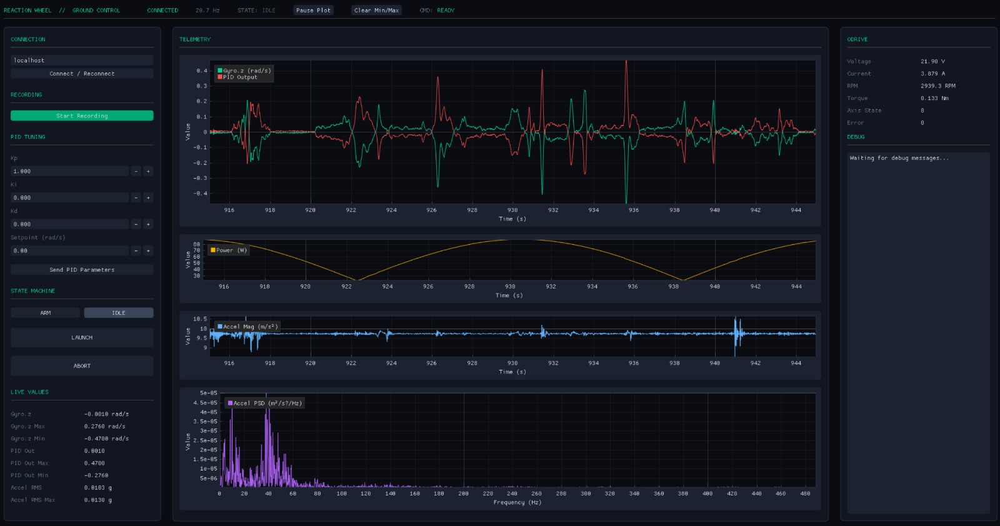

# Reaction Wheel PCB Firmware and Live Telemetry

Embedded firmware for a reaction wheel–based roll stabilization system, designed for a high-power rocket. Built on an **ESP32** running **FreeRTOS**, the system reads angular rate from an ICM-4xxxx series IMU over SPI, runs a PID controller to compute a correction torque, and drives a brushless motor via an ODrive motor controller over CAN (TWAI). Flight state and PID tuning are managed remotely over **WiFi + MQTT**.



---

## Features

- **Interrupt-driven IMU sampling** at 1 kHz via hardware INT pin
- **PID roll controller** with anti-windup and derivative-on-measurement
- **CAN bus (TWAI) output** to ODrive motor controller
- **Remote tuning** PID gains and setpoint updatable live over MQTT
- **State machine** with four flight states: `IDLE → ARMED → LAUNCH → ABORT`
- **Automatic abort** triggered on MQTT disconnect during flight
- **Batch telemetry** gyro Z, PID output, and accel magnitude streamed to ground station
- **LED blink patterns** encode current flight state for visual confirmation
- **Ground station scripts** for real-time telemetry plotting and FFT vibration analysis

---

## Flight State Machine

| State    | PID | TWAI/Motor | IMU | Triggered By |
|----------|-----|------------|-----|--------------|
| `IDLE`   | Off | Off        | Off | Default / `IDLE` command |
| `ARMED`  | On  | Off        | On  | `ARMED` command |
| `LAUNCH` | On  | On         | On  | `LAUNCH` command |
| `ABORT`  | Off | Off        | Off | `ABORT` command or MQTT disconnect |

Once `ABORT` is entered, a hardware reset is required to resume operations.

---

## Repository Structure

```
├── main.c            # Entry point — driver init, FreeRTOS task launch
├── imu.c/h           # ICM IMU driver — SPI read/write, interrupt task, telemetry batching
├── pid.c/h           # PID controller — compute, reset, anti-windup
├── twai.c/h          # CAN bus driver — ODrive command TX, telemetry RX
├── statemachine.c/h  # Flight state machine — state transitions, subsystem enable/disable
├── mqtt.c/h          # MQTT client — publish telemetry, subscribe to commands
├── wifi.c/h          # WiFi station init and reconnect logic
├── spi.c/h           # SPI bus init (shared by IMU)
├── blink.c/h         # LED status patterns per flight state
├── config.h          # Pin definitions, PID defaults, timing constants
├── ground_control.py # MQTT ground station — command sender & telemetry logger
├── telemetry.py      # Post-flight telemetry plotter (gyro, PID, RPM, power)
└── fft.py            # Vibration analysis — FFT frames + RMS-over-time plots
```

---

## Hardware

| Component | Details |
|-----------|---------|
| Microcontroller | ESP32 (ESP-IDF, FreeRTOS) |
| IMU | ICM series (SPI, 1 kHz, ±2000 dps gyro, 32.768 kHz CLKIN) |
| Motor Controller | ODrive (CAN/TWAI, 250 kbps) |
| Motor | Brushless DC reaction wheel motor |
| Comms | 802.11 WiFi → MQTT broker |

---

## MQTT Topics

| Topic | Direction | Payload |
|-------|-----------|---------|
| `rocket/state` | Ground → Rocket | `IDLE` \| `ARMED` \| `LAUNCH` \| `ABORT` |
| `rocket/pid_set` | Ground → Rocket | `{"kp":…,"ki":…,"kd":…,"sp":…}` |
| `rocket/telemetry` | Rocket → Ground | Batched JSON: `gz`, `out`, `amag`, `t` arrays |
| `rocket/odrive/heartbeat` | Rocket → Ground | `{"error":…,"state":…}` |
| `rocket/odrive/rpm` | Rocket → Ground | `{"rpm":…}` |
| `rocket/odrive/iq` | Rocket → Ground | `{"iq":…}` |
| `rocket/odrive/bus` | Rocket → Ground | `{"vbus":…,"ibus":…}` |
| `rocket/debug` | Rocket → Ground | ESP-IDF log forwarding |

---

## Installation & Setup

### 1 — ESP-IDF

Install ESP-IDF v5.x by following the [official guide](https://docs.espressif.com/projects/esp-idf/en/latest/esp32/get-started/). On Linux/macOS:

```bash
git clone --recursive https://github.com/espressif/esp-idf.git
cd esp-idf
./install.sh esp32
. ./export.sh
```

On Windows, use the [ESP-IDF Windows Installer](https://docs.espressif.com/projects/esp-idf/en/latest/esp32/get-started/windows-setup.html).

### 2 — MQTT Broker (Mosquitto)

Download and install **Eclipse Mosquitto** from [mosquitto.org](https://mosquitto.org/download/).

On Windows, use the installer from the Eclipse Mosquitto download page. The broker runs on port `1883` by default.

### 3 — MQTT GUI (Optional but Recommended)

**[MQTT Explorer](https://mqtt-explorer.com/)** is a lightweight, cross-platform GUI that gives a live tree view of all active topics and their payloads. It's highly recommended for monitoring telemetry and debugging during bench testing. Download it from [mqtt-explorer.com](https://mqtt-explorer.com/).

### 4 — Python Ground Station

```bash
pip install paho-mqtt pandas matplotlib numpy dearpygui
```

### 5 — Configure the Firmware

Edit `config.h` with your network details and pin assignments:

```c
// WiFi
#define WIFI_SSID   "your-ssid"
#define WIFI_PASS   "your-password"

// PID defaults
#define PID_KP          ...
#define PID_KI          ...
#define PID_KD          ...
#define PID_SETPOINT    0.0f
#define PID_OUTPUT_MAX  ...

// Timing
#define PUB_INTERVAL_US     ...   // TWAI publish rate
#define ACCEL_BATCH_SIZE    ...   // IMU samples per MQTT batch

// Pin assignments
#define SPI_MOSI_PIN   ...
#define SPI_MISO_PIN   ...
#define SPI_CLK_PIN    ...
#define SPI_CS_PIN     ...
#define IMU_INT_PIN    ...
#define IMU_CLKIN_PIN  ...
#define CANTX_PIN      ...
#define CANRX_PIN      ...
#define LED_PIN        ...
```

The MQTT broker IP is set directly in `mqtt.c`:
```c
.broker.address.uri = "mqtt://YOUR_BROKER_IP:1883",
```

### 6 — Build & Flash

```bash
# Set target
idf.py set-target esp32

# (Optional) open menuconfig for advanced settings
idf.py menuconfig

# Build, flash, and open serial monitor
idf.py build flash monitor
```

The serial monitor will show ESP-IDF log output. All logs are also forwarded to the `rocket/debug` MQTT topic once WiFi is connected.

---

## Ground Station

**`ground_control.py`** — connects to the MQTT broker, sends state and PID commands, and logs raw telemetry to a timestamped CSV.

**`telemetry.py`** — loads a telemetry CSV and plots gyro Z, PID output, accel magnitude, power, and RPM over time.

**`fft.py`** — loads a JSON file of FFT frames and plots per-frame power spectral density and RMS acceleration over time, useful for diagnosing vibration modes.

---

## Safety Notes

- The system will automatically enter `ABORT` state if the MQTT connection drops after having been established preventing a runaway motor in the event of a communication failure mid-flight.
- Once in `ABORT`, the state machine ignores all further commands until the ESP32 is physically reset.
- The ODrive motor output is only enabled in `LAUNCH` state; `ARMED` runs the PID and IMU but keeps the motor offline for ground testing.
